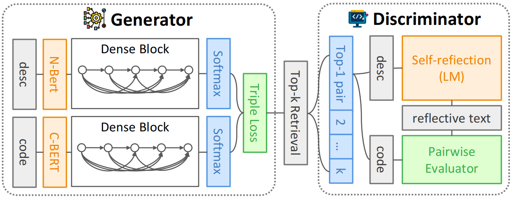

# ReflectCode: Adversarial Reflection-Augmented Code Retrieval Framework

[](LICENSE)

> **Repository-Level Code Retrieval for Change Request-Driven Scenarios**

<div align="center">
  
  <p><em>Dual-Tower Architecture with Adversarial Reflection Mechanism</em></p>
</div>

## 📖 Overview
Modern software evolution demands code retrieval systems that understand cross-component change intents. **ReflectCode** addresses this challenge through:

- **Holistic Repository Analysis**: Shift from function-centric to repository-level pattern understanding
- **Adversarial Dual-Tower Architecture**: 
  - 🧠 *Semantic Intent Tower*: LLM-powered cross-module dependency modeling
  - 🧩 *Syntactic Pattern Tower*: Tree-sitter based structural feature extraction
- **Dynamic Fusion Mechanism**: Context-aware integration of syntactic, semantic and dependency features

**Key Achievement**:  
✅ **12.2%** Top-5 Accuracy improvement over SOTA baselines  
✅ First benchmark for change request-driven retrieval (52K test cases)

## 🚀 Quick Start

### Prerequisites
```bash
# Install Tree-sitter dependencies
sudo apt-get update && sudo apt-get install -y \
    build-essential \
    python3-dev \
    nodejs

# Create virtual environment
python3 -m venv .venv
source .venv/bin/activate
pip install -r requirements.txt
```

### Installation
```bash
# Clone with submodules
git clone --recurse-submodules https://github.com/yourusername/reflectcode.git

# Initialize submodules (if already cloned)
git submodule init
git submodule update --init --recursive
```

### Running Pipeline
| Mode       | Command                      | Description                     |
|------------|------------------------------|---------------------------------|
| Training   | `bash scripts/run.sh --mode train` | Start model training            |
| Inference  | `bash scripts/run.sh --mode infer` | Generate code recommendations   |
| Evaluation | `bash scripts/eval.sh`       | Benchmark performance analysis  |

## 📚 Benchmark Details
**CR-Bench** (Change Request Benchmark) characteristics:

| Metric          | Value     |
|-----------------|-----------|
| Total Test Cases| 52,000    |
| Avg. Contexts   | 4.7/file  |
| Languages       | 6         |
| Cross-module    | 68% cases |

RepoAlignBench:
[](https://huggingface.co/datasets/bPtBvkTP/RepoAlignBench-Full)

RepoAlignBench-Medium:
[](https://huggingface.co/datasets/bPtBvkTP/RepoAlignBench-Medium)

RepoAlignBench-Hard:
[](https://huggingface.co/datasets/bPtBvkTP/RepoAlignBench-Hard)

```python
{
    "Language":"Python",
    "Code":"\\"\\"\\"Test ``with_redshift`` with the distance off.\\"\\"\\"\\n        default_cosmo = default_cosmology.get()\\n        z = 15 * cu.redshift\\n\\n        # 1) Default (without specifying the cosmology)\\n        with default_cosmology.set(cosmo):\\n            equivalency = cu.with_redshift(distance=None)\\n            with pytest.raises(u.UnitConversionError, match=\\"\'redshift\' and \'Mpc\'\\"):\\n                z.to(u.Mpc, equivalency)\\n\\n        # 2) Specifying the cosmology\\n        equivalency = cu.with_redshift(cosmo, distance=None)\\n        with pytest.raises(u.UnitConversionError, match=\\"\'redshift\' and \'Mpc\'\\"):\\n            z.to(u.Mpc, equivalency)",
    "Query":"Modeling\'s `separability_matrix` does not compute separability correctly for nested CompoundModels\\nConsider the following model:\\r\\n\\r\\n```python\\r\\nfrom astropy.modeling import models as m\\r\\nfrom astropy.modeling.separable import separability_matrix\\r\\n\\r\\ncm = m.Linear1D(10) & m.Linear1D(5)\\r\\n```\\r\\n\\r\\nIt\'s separability matrix as you might expect is a diagonal:\\r\\n\\r\\n```python\\r\\n>>> separability_matrix(cm)\\r\\narray([[ True, False],\\r\\n       [False,  True]])\\r\\n```\\r\\n\\r\\nIf I make the model more complex:\\r\\n```python\\r\\n>>> separability_matrix(m.Pix2Sky_TAN() & m.Linear1D(10) & m.Linear1D(5))\\r\\narray([[ True,  True, False, False],\\r\\n       [ True,  True, False, False],\\r\\n       [False, False,  True, False],\\r\\n       [False, False, False,  True]])\\r\\n```\\r\\n\\r\\nThe output matrix is again, as expected, the outputs and inputs to the linear models are separable and independent of each other.\\r\\n\\r\\nIf however, I nest these compound models:\\r\\n```python\\r\\n>>> separability_matrix(m.Pix2Sky_TAN() & cm)\\r\\narray([[ True,  True, False, False],\\r\\n       [ True,  True, False, False],\\r\\n       [False, False,  True,  True],\\r\\n       [False, False,  True,  True]])\\r\\n```\\r\\nSuddenly the inputs and outputs are no longer separable?\\r\\n\\r\\nThis feels like a bug to me, but I might be missing something?\\n",
    "URI":"own_ds\\/ds_content\\/astropy_d16bfe05a744909de4b27f5875fe0d4ed41ce607#test_distance_off",
    "Relevance":0,
    "Notes":""
}

```

## 📦 Submodule Structure
```text
vendor/
├── tree-sitter-python      # Syntax parser for Python
├── tree-sitter-java        # Java AST extraction
├── tree-sitter-php         # PHP language support
└── ...                     # Other language parsers
```
